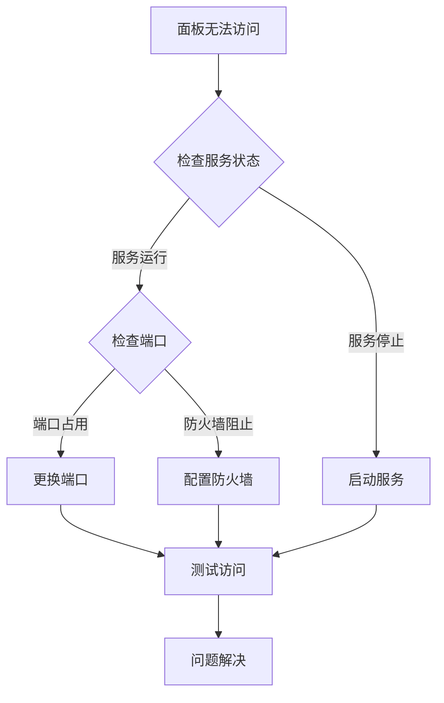

# LNMP运维面板故障排除指南

## 快速诊断流程



## 常见问题分类

### 1. 安装问题

#### 问题: 安装脚本执行失败
**症状**: 脚本执行过程中出现错误或中断

**解决方案**:
```bash
# 检查系统架构
uname -m

# 检查依赖是否安装
which systemctl
which wget
which curl

# 手动执行安装步骤
sudo -i
./deploy/install_part1.sh
./deploy/install_part2.sh  
./deploy/install_part3.sh
```

#### 问题: 二进制文件无法执行
**症状**: 执行面板程序时提示权限不足或格式错误

**解决方案**:
```bash
# 检查文件权限
ls -la /opt/lnmp-panel/lnmp-panel

# 添加执行权限
chmod +x /opt/lnmp-panel/lnmp-panel

# 检查文件类型
file /opt/lnmp-panel/lnmp-panel

# 如果是ARMv7l架构，应该显示:
# ELF 32-bit LSB executable, ARM, EABI5 version 1
```

### 2. 服务管理问题

#### 问题: 服务状态显示不正确
**症状**: 面板显示的服务状态与实际状态不符

**诊断步骤**:
```bash
# 检查实际服务状态
systemctl status nginx
systemctl status mysql
systemctl status php-fpm

# 检查面板服务状态
systemctl status lnmp-panel

# 查看面板日志
journalctl -u lnmp-panel -f
```

**解决方案**:
```bash
# 重启面板服务
systemctl restart lnmp-panel

# 检查服务配置文件
cat /opt/lnmp-panel/config.json

# 验证服务名称是否正确
systemctl list-units | grep -E "(nginx|mysql|php)"
```

#### 问题: 服务操作失败
**症状**: 点击启动/停止/重启按钮无响应或报错

**诊断步骤**:
```bash
# 检查系统权限
sudo -u lnmp-panel systemctl status nginx

# 检查SELinux状态
getenforce

# 查看详细错误信息
journalctl -u lnmp-panel --since "1 hour ago"
```

**解决方案**:
```bash
# 如果是权限问题
sudo usermod -a -G systemd-journal lnmp-panel
sudo systemctl daemon-reload

# 如果是SELinux阻止
sudo setsebool -P httpd_execmem on
sudo setsebool -P httpd_can_network_connect on

# 临时禁用SELinux（不推荐生产环境）
sudo setenforce 0
```

### 3. 配置管理问题

#### 问题: 配置文件无法读取
**症状**: 配置编辑页面显示"读取配置文件失败"

**诊断步骤**:
```bash
# 检查配置文件是否存在
ls -la /etc/nginx/nginx.conf
ls -la /etc/mysql/my.cnf
ls -la /etc/php/fpm/php-fpm.conf

# 检查文件权限
ls -la /etc/nginx/
ls -la /etc/mysql/
ls -la /etc/php/

# 测试读取权限
sudo -u lnmp-panel cat /etc/nginx/nginx.conf
```

**解决方案**:
```bash
# 修改文件权限（谨慎操作）
sudo chmod 644 /etc/nginx/nginx.conf
sudo chown root:root /etc/nginx/nginx.conf

# 或者将lnmp-panel用户添加到相关组
sudo usermod -a -G nginx lnmp-panel
sudo usermod -a -G mysql lnmp-panel
```

#### 问题: 配置保存失败
**症状**: 保存配置时提示"更新配置文件失败"

**诊断步骤**:
```bash
# 检查文件写权限
ls -la /etc/nginx/nginx.conf

# 测试写权限
sudo -u lnmp-panel echo "test" >> /etc/nginx/nginx.conf

# 检查磁盘空间
df -h /etc/nginx/
```

**解决方案**:
```bash
# 备份原配置
sudo cp /etc/nginx/nginx.conf /etc/nginx/nginx.conf.backup

# 临时放宽权限（操作后恢复）
sudo chmod 666 /etc/nginx/nginx.conf

# 或者使用sudo权限
sudo visudo
# 添加: lnmp-panel ALL=(root) NOPASSWD: /bin/cp
```

### 4. 日志查看问题

#### 问题: 日志无法显示
**症状**: 日志查看页面显示空白或错误信息

**诊断步骤**:
```bash
# 检查日志文件是否存在
sudo ls -la /var/log/nginx/
sudo ls -la /var/log/mysql/

# 检查日志文件权限
sudo -u lnmp-panel cat /var/log/nginx/access.log

# 测试journalctl命令
sudo -u lnmp-panel journalctl -u nginx -n 10 --no-pager
```

**解决方案**:
```bash
# 修改日志目录权限
sudo chmod 755 /var/log/nginx/
sudo chmod 644 /var/log/nginx/*.log

# 将用户添加到adm组
sudo usermod -a -G adm lnmp-panel

# 重启rsyslog服务
sudo systemctl restart rsyslog
```

### 5. 性能问题

#### 问题: 面板响应缓慢
**症状**: 页面加载慢，操作响应延迟

**诊断步骤**:
```bash
# 检查系统资源
top -p $(pgrep lnmp-panel)

# 检查内存使用
free -h

# 检查磁盘IO
iostat -x 1 3

# 检查网络连接
netstat -an | grep 8080
```

**优化方案**:
```bash
# 优化面板配置
cat > /opt/lnmp-panel/config.json << EOF
{
    "port": 8080,
    "web_root": "/var/www/html",
    "log_path": "/var/log",
    "services": ["nginx", "mysql", "php-fpm"]
}
EOF

# 限制资源使用
sudo systemctl edit lnmp-panel
```

添加以下内容:
```ini
[Service]
MemoryLimit=256M
CPUQuota=80%
LimitNOFILE=65536
```

### 6. 网络连接问题

#### 问题: 无法从外部访问
**症状**: 本地可以访问，但外部网络无法连接

**诊断步骤**:
```bash
# 检查服务监听
netstat -tulpn | grep 8080

# 检查防火墙状态
sudo ufw status
# 或
sudo firewall-cmd --list-all

# 测试本地访问
curl http://localhost:8080/health

# 测试外部访问（从其他机器）
curl http://服务器IP:8080/health
```

**解决方案**:
```bash
# 开放防火墙端口
sudo ufw allow 8080/tcp
# 或
sudo firewall-cmd --add-port=8080/tcp --permanent
sudo firewall-cmd --reload

# 检查绑定地址
ss -tulpn | grep 8080

# 如果是Docker部署，检查端口映射
docker ps
docker port lnmp-panel
```

### 7. 安全相关问题

#### 问题: 安全警告或权限错误
**症状**: 出现安全相关的错误信息

**诊断步骤**:
```bash
# 检查文件权限
namei -l /opt/lnmp-panel/lnmp-panel

# 检查SELinux上下文
ls -Z /opt/lnmp-panel/

# 查看安全日志
sudo grep lnmp-panel /var/log/audit/audit.log
sudo grep lnmp-panel /var/log/auth.log
```

**解决方案**:
```bash
# 修复文件权限
sudo chown -R lnmp-panel:lnmp-panel /opt/lnmp-panel
sudo chmod 755 /opt/lnmp-panel
sudo chmod 644 /opt/lnmp-panel/config.json

# 设置SELinux上下文
sudo chcon -t bin_t /opt/lnmp-panel/lnmp-panel
```

## 高级调试技巧

### 启用详细日志
```bash
# 修改面板启动参数
sudo systemctl edit lnmp-panel

# 添加环境变量
[Service]
Environment="GIN_MODE=debug"
```

### 使用strace跟踪系统调用
```bash
# 跟踪面板进程
sudo strace -p $(pgrep lnmp-panel) -f -o /tmp/lnmp-panel.strace

# 分析系统调用
grep -E "(open|read|write|connect)" /tmp/lnmp-panel.strace
```

### 网络抓包分析
```bash
# 安装tcpdump
sudo apt install tcpdump

# 抓取8080端口通信
sudo tcpdump -i any port 8080 -w /tmp/lnmp-panel.pcap
```

## 紧急恢复措施

### 面板完全无法启动
```bash
# 停止服务
sudo systemctl stop lnmp-panel

# 手动启动调试
cd /opt/lnmp-panel
sudo -u lnmp-panel ./lnmp-panel

# 查看错误输出
```

### 配置文件损坏
```bash
# 从备份恢复
sudo cp /opt/lnmp-panel/config.json.backup /opt/lnmp-panel/config.json

# 或重新创建默认配置
cat > /opt/lnmp-panel/config.json << EOF
{
    "port": 8080,
    "web_root": "/var/www/html",
    "log_path": "/var/log",
    "services": ["nginx", "mysql", "php-fpm"]
}
EOF
```

### 系统资源耗尽
```bash
# 检查并杀死僵尸进程
ps aux | grep lnmp-panel
sudo kill -9 僵尸进程PID

# 清理系统资源
sudo sync
echo 3 | sudo tee /proc/sys/vm/drop_caches

# 重启服务
sudo systemctl restart lnmp-panel
```

## 联系支持

如果以上方法都无法解决问题，请提供以下信息：

1. 系统版本: `cat /etc/os-release`
2. 架构信息: `uname -a`
3. 面板版本: `/opt/lnmp-panel/lnmp-panel --version`
4. 错误日志: `journalctl -u lnmp-panel --since "today"`
5. 配置文件: `cat /opt/lnmp-panel/config.json`

将以上信息发送到项目Issue页面或技术支持邮箱。